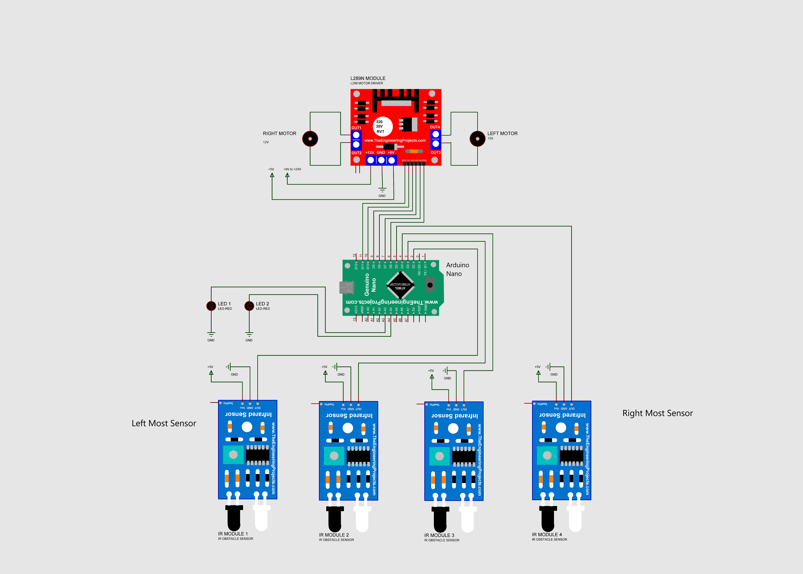

# Line-Follower-Rover
An Autonomous PID algorithm based Line Follower Robot
### Components 
1. Arduino Nano - 1X
2. L298N Motor Driver - 1X
3. N20 DC Motor - 2X
4. IR Sensor - 4X
5. Red LED - 2X
6. Wire & Jumper
7. LiPo Battery 
8. Robot Mechanical Body 
### Diagram

